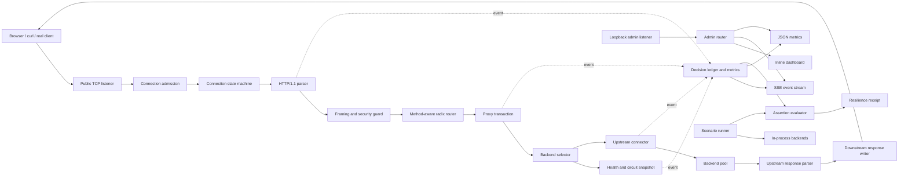

# Anvil — Architecture

## 1. Architectural intent

Anvil separates the data plane that handles application traffic from the control/observation plane used by operators and experiments. Both planes reuse the same raw HTTP/1.1 engine, which proves that the protocol implementation is a reusable foundation rather than a demo-specific parser.



## 2. Planes

### 2.1 Data plane

The data plane owns client connections, HTTP decoding, route selection, backend selection, request forwarding, response decoding, and downstream serialization. Its work must remain bounded and independent of dashboard speed.

### 2.2 Control and observation plane

The administration listener binds to loopback by default. It serves the dashboard, metrics, event stream, experiment status, and safe local experiment controls. It does not share a listener with public application traffic unless the user explicitly configures that behavior.

### 2.3 Experiment plane

The experiment runner schedules faults against in-process fixtures, generates bounded load, records expected transitions, and evaluates ledger-derived assertions. It must not mutate production configuration implicitly.

## 3. Major components

### 3.1 Listener and admission controller

Responsibilities:

- Bind TCP address.
- Accept connections.
- Enforce a global connection semaphore.
- Apply initial deadlines.
- Spawn one goroutine per admitted connection.
- Reject or close excess connections without unbounded goroutine creation.
- Coordinate graceful shutdown.

### 3.2 Connection state machine

Each client connection owns:

- A `bufio.Reader` and `bufio.Writer`.
- Connection timestamps and request count.
- Read/write/idle deadlines.
- Parser scratch buffers.
- The sequential request/response loop.

Only one request is processed at a time on a connection. Bytes already buffered for the next request remain in the reader. Pipelining is not supported as concurrent outstanding work.

### 3.3 HTTP codec

The codec is transport-agnostic above `io.Reader`/`io.Writer` boundaries.

Core conceptual types:

```text
Request
  Method
  Target
  Version
  Headers[]HeaderField
  Body[]byte
  BodyMode
  KeepAlive

Response
  Version
  StatusCode
  Reason
  Headers[]HeaderField
  Body[]byte or streaming writer
  Close

HeaderField
  Name
  Value
```

Headers are represented as ordered fields rather than a single-value map so duplicates can be validated correctly and unknown end-to-end fields can be preserved.

The codec exposes typed protocol failures such as malformed start line, invalid header, ambiguous framing, limit exceeded, timeout, and incomplete body.

### 3.4 Router

The router indexes first by method and then by path tree. A fallback method bucket may be used for proxy routes that accept any valid method token.

Node kinds:

- Static segment.
- Named parameter.
- Terminal wildcard.

Registration is single-threaded before serving. The resulting tree is immutable during traffic, allowing lock-free lookup.

### 3.5 Proxy transaction

A proxy transaction is the unit of request work:

1. Resolve route and backend pool.
2. Order candidates using round robin or least in-flight.
3. Under the candidate's local state lock, verify active health and circuit permission and claim any half-open permit.
4. Claim the non-blocking in-flight admission token.
5. Acquire a non-expired idle connection or dial with a timeout.
6. Sanitize and serialize the upstream request.
7. Read and validate the complete upstream response.
8. Classify the passive outcome and release admission exactly once.
9. Decide whether a distinct-backend safe retry is possible.
10. Attach request ID and `Proxy-Status`, then return the buffered response to the downstream writer.
11. The downstream writer validates, marks commitment, serializes, and flushes.

The transaction records whether downstream headers or body bytes have been committed. Once committed, retry is prohibited. The current buffered design means retry decisions occur before the handler returns; the commitment guard remains explicit so later streaming work cannot weaken this boundary.

### 3.6 Backend state and selectors

Each backend has an immutable identity/configuration and mutable runtime state:

```text
Immutable: alias, address, authority, limits, health path
Active health eligibility and consecutive thresholds
Circuit state, passive failure window, open timestamp
Atomic in-flight count and bounded admission channel
Half-open in-flight permits and success evidence
Bounded idle connections and expiry
```

Round robin uses an atomic sequence over the immutable backend slice and skips ineligible candidates. Least-in-flight stable-sorts the same rotated order by atomic active-request count, preserving a fair tie break. State permission and admission are rechecked during reservation, so a stale observation cannot bypass a concurrent transition.

### 3.7 Health and circuit engine

Active probes and passive request outcomes remain distinct inputs to one state owner per backend. Transitions are serialized under a small backend-local mutex. No global lock is held during network I/O, and transition callbacks run only after unlocking so observers may safely request a snapshot.

The circuit state machine is:

```text
CLOSED --trip--> OPEN --cooldown--> HALF_OPEN
   ^                              |       |
   |---------------- success -----|       |
   |---------------------- failure -------|
```

Health and circuit are related but not identical. A backend can be actively reachable while the circuit is open because recent application traffic failed. Selection requires both health eligibility and circuit permission.

Active checks have independent failure and recovery thresholds and use the same raw TCP HTTP codec as proxy traffic. During an open circuit they continue measuring reachability; after cooldown, one may claim a bounded half-open permit and provide the success/failure evidence that closes or reopens the circuit. The checker owns one cancelable worker per backend and joins all workers on stop.

### 3.8 Upstream reuse and retry

Each backend owns a fixed-capacity idle stack. A connection is returned only after a complete persistent response has been parsed; close-delimited, explicitly closing, failed, timed-out, canceled, malformed, expired, surplus, and shutdown connections are closed. The pool has no sweeper goroutine: expiry is enforced on acquisition, and explicit pool close drains all idle sockets.

Retry is a transaction policy, not a transport loop. Only buffered `GET` and `HEAD` requests are eligible, the downstream commitment flag must be false, attempts target distinct aliases, and both attempt count and total duration are bounded. Application statuses require an explicit retry set. If a buffered application response cannot fail over, Anvil returns that response instead of manufacturing a gateway failure.

### 3.9 Decision ledger

The ledger is a fixed-capacity ring containing sanitized metadata events:

```text
Sequence
Monotonic elapsed time
Request ID
Event type
Route alias
Backend alias
Reason code
Numeric observations
```

It stores no request/response bodies, cookies, authorization values, or raw private backend addresses.

Event publication is non-blocking. The data plane updates atomic metrics and attempts to publish to subscriber queues. A full subscriber queue increments a drop counter rather than blocking traffic.

### 3.10 Metrics

Metrics combine:

- Atomic counters.
- Fixed latency buckets.
- Backend snapshots.
- Selected `runtime/metrics` samples.

Percentiles are approximated from buckets and labelled as estimates. Metrics are in-memory only.

### 3.11 Dashboard and SSE

The HTML, CSS, and JavaScript are stored as Go raw string constants if the Single File bonus remains viable. The dashboard uses same-origin SSE from the loopback admin listener.

SSE rules:

- UTF-8 `text/event-stream`.
- Monotonic event IDs.
- Heartbeat comments.
- Bounded per-client queue.
- Reconnection support through `Last-Event-ID` where retained events remain available.

### 3.11 Scenario runner and fixtures

Fixtures run on loopback using the same HTTP server engine. A fixture has an atomic behavior profile: healthy, delayed, fixed failure status, truncated response, or unavailable. Scenario steps are scheduled relative to experiment start and recorded before application.

The receipt is calculated from ledger sequence/timing, not from dashboard state.

### 3.12 Benchmark engine

The benchmark client reuses the request serializer and response parser. It owns a bounded worker set and reports:

- Throughput.
- Latency buckets.
- Error categories.
- New/reused connections.
- Status distribution.
- Transferred bytes.

It must enforce a maximum concurrency and duration and terminate cleanly on cancellation.

## 4. Concurrency ownership

| State | Owner/synchronization |
|---|---|
| Client parser and buffers | Connection goroutine only |
| Router | Immutable after startup |
| Backend in-flight count | Atomic |
| Backend circuit/health transition | Backend-local mutex |
| Round-robin sequence | Atomic |
| Global admission | Buffered channel/semaphore |
| Metrics counters | Atomics |
| Latency buckets | Atomic counters |
| Ledger ring | Single mutex or single-writer event loop, selected after benchmark |
| SSE subscriber queue | Bounded channel per subscriber |
| Fixture behavior | Atomic snapshot |

No lock may be held while dialing, reading, writing, sleeping, or publishing to an observer.

## 5. Error taxonomy

```text
NetworkError
  DialRefused
  DialTimeout
  ReadTimeout
  WriteTimeout
  UnexpectedEOF

ProtocolError
  MalformedStartLine
  MalformedHeader
  AmbiguousFraming
  UnsupportedTransferCoding
  LimitExceeded

PolicyError
  RouteNotFound
  NoEligibleBackend
  AdmissionRejected
  RetryNotAllowed

InternalError
  InvariantViolation
  HandlerFailure
```

Each proxy failure maps to an HTTP status, a `Proxy-Status` error token where defined, a ledger reason code, and a metric counter.

## 6. Security boundaries

- The public listener never exposes experiment mutation endpoints.
- The admin listener defaults to loopback.
- Forwarding headers are trusted only from explicitly configured trusted proxies.
- Header values are validated before serialization to prevent CR/LF injection.
- Bodies and sensitive headers never enter the ledger.
- All client-controlled lengths are checked before allocation.
- Slow clients and upstreams are bounded by deadlines.
- Unknown end-to-end headers are preserved; hop-by-hop headers are removed.

## 7. Single-file packaging

The architecture remains componentized even if delivered in `main.go`. Sections, types, and functions correspond to the components above. Tests may remain in `main_test.go`, and protocol corpora may remain under `testdata/` per organizer clarification.

The single-file bonus is abandoned if consolidation creates duplicated logic, hidden coupling, or a file the team cannot explain.

## 8. Standard-library map

| Concern | Go standard library |
|---|---|
| TCP and addressing | `net` |
| Buffered protocol I/O | `bufio`, `io`, `bytes` |
| CLI | `flag`, `os` |
| JSON | `encoding/json/v2` after local API verification |
| IDs and hashes | Go 1.27 `uuid`, `crypto/sha256` |
| Synchronization | `sync`, `sync/atomic` |
| Timing/cancellation | `time`, `context`, `os/signal` |
| Logging | `log/slog` |
| Runtime metrics | `runtime/metrics` |
| Testing | `testing`, `testing/synctest` |
| Compatibility oracle in tests | `net/http`, `net/http/httptest` |
