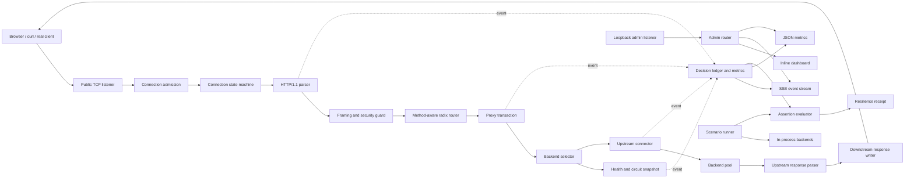

# Anvil — Architecture

## 1. Architectural intent

Anvil separates the data plane that handles application traffic from the control/observation plane used by operators and experiments. Both planes reuse the same raw HTTP/1.1 engine, which proves that the protocol implementation is a reusable foundation rather than a demo-specific parser.



## 2. Planes

### 2.1 Data plane

The data plane owns client connections, HTTP decoding, route selection, backend selection, request forwarding, response decoding, and downstream serialization. Its work must remain bounded and independent of dashboard speed.

### 2.2 Control and observation plane

The administration listener requires an explicit loopback address. It serves the read-only dashboard, metrics, event stream, and health endpoint on a listener separate from public application traffic.

### 2.3 Experiment plane

The experiment runner schedules faults against in-process fixtures, generates bounded load, records expected transitions, and evaluates ledger-derived assertions. It must not mutate production configuration implicitly.

## 3. Major components

### 3.1 Listener and admission controller

Responsibilities:

- Bind TCP address.
- Accept connections.
- Enforce a global connection semaphore.
- Apply initial deadlines.
- Spawn one goroutine per admitted connection.
- Reject or close excess connections without unbounded goroutine creation.
- Coordinate graceful shutdown.

### 3.2 Connection state machine

Each client connection owns:

- A `bufio.Reader` and `bufio.Writer`.
- Connection timestamps and request count.
- Read/write/idle deadlines.
- Parser scratch buffers.
- The sequential request/response loop.

Only one request is processed at a time on a connection. Bytes already buffered for the next request remain in the reader. Pipelining is not supported as concurrent outstanding work.

### 3.3 HTTP codec

The codec is transport-agnostic above `io.Reader`/`io.Writer` boundaries.

Core conceptual types:

```text
Request
  Method
  Target
  Version
  Headers[]HeaderField
  Body[]byte
  BodyMode
  KeepAlive

Response
  Version
  StatusCode
  Reason
  Headers[]HeaderField
  Body[]byte
  Close

HeaderField
  Name
  Value
```

Headers are represented as ordered fields rather than a single-value map so duplicates can be validated correctly and unknown end-to-end fields can be preserved.

The codec exposes typed protocol failures such as malformed start line, invalid header, ambiguous framing, limit exceeded, timeout, and incomplete body.

### 3.4 Router

The router indexes first by method and then by path tree. A fallback method bucket may be used for proxy routes that accept any valid method token.

Node kinds:

- Static segment.
- Named parameter.
- Terminal wildcard.

Registration is single-threaded before serving. The resulting tree is immutable during traffic, allowing lock-free lookup.

### 3.5 Proxy transaction

A proxy transaction is the unit of request work:

1. Resolve route and backend pool.
2. Order candidates using round robin or least in-flight.
3. Under the candidate's local state lock, verify active health and circuit permission and claim any half-open permit.
4. Claim the non-blocking in-flight admission token.
5. Acquire a non-expired idle connection or dial with a timeout.
6. Sanitize and serialize the upstream request.
7. Read and validate the complete upstream response.
8. Classify the passive outcome and release admission exactly once.
9. Decide whether a distinct-backend safe retry is possible.
10. Attach request ID and `Proxy-Status`, then return the buffered response to the downstream writer.
11. The downstream writer validates, marks commitment, serializes, and flushes.

The transaction records whether downstream headers or body bytes have been committed. Once committed, retry is prohibited. The current buffered design means retry decisions occur before the handler returns; the commitment guard remains explicit so later streaming work cannot weaken this boundary.

### 3.6 Backend state and selectors

Each backend has an immutable identity/configuration and mutable runtime state:

```text
Immutable: alias, address, authority, limits, health path
Active health eligibility and consecutive thresholds
Circuit state, passive failure window, open timestamp
Atomic in-flight count and bounded admission channel
Half-open in-flight permits and success evidence
Bounded idle connections and expiry
```

Round robin uses an atomic sequence over the immutable backend slice and skips ineligible candidates. Least-in-flight stable-sorts the same rotated order by atomic active-request count, preserving a fair tie break. State permission and admission are rechecked during reservation, so a stale observation cannot bypass a concurrent transition.

### 3.7 Health and circuit engine

Active probes and passive request outcomes remain distinct inputs to one state owner per backend. Transitions are serialized under a small backend-local mutex. No global lock is held during network I/O, and transition callbacks run only after unlocking so observers may safely request a snapshot.

The circuit state machine is:

```text
CLOSED --trip--> OPEN --cooldown--> HALF_OPEN
   ^                              |       |
   |---------------- success -----|       |
   |---------------------- failure -------|
```

Health and circuit are related but not identical. A backend can be actively reachable while the circuit is open because recent application traffic failed. Selection requires both health eligibility and circuit permission.

Active checks have independent failure and recovery thresholds and use the same raw TCP HTTP codec as proxy traffic. During an open circuit they continue measuring reachability; after cooldown, one may claim a bounded half-open permit and provide the success/failure evidence that closes or reopens the circuit. The checker owns one cancelable worker per backend and joins all workers on stop.

### 3.8 Upstream reuse and retry

Each backend owns a fixed-capacity idle stack. A connection is returned only after a complete persistent response has been parsed; close-delimited, explicitly closing, failed, timed-out, canceled, malformed, expired, surplus, and shutdown connections are closed. The pool has no sweeper goroutine: expiry is enforced on acquisition, and explicit pool close drains all idle sockets.

Retry is a transaction policy, not a transport loop. Only buffered `GET` and `HEAD` requests are eligible, the downstream commitment flag must be false, attempts target distinct aliases, and both attempt count and total duration are bounded. Application statuses require an explicit retry set. If a buffered application response cannot fail over, Anvil returns that response instead of manufacturing a gateway failure.

### 3.9 Decision ledger

The ledger is a fixed-capacity ring containing sanitized metadata events:

```text
Sequence
Monotonic elapsed time
Request ID
Event type
Route alias
Backend alias
Reason code
Numeric observations
```

Event types are request start, backend selection, attempt failure, retry scheduling, request completion, circuit transition, health transition, and fixture transition. The ledger stores no request/response bodies, cookies, authorization values, or raw private backend addresses; those fields do not exist in the event type.

The ledger assigns a sequence under its short memory-only mutex. A condition-based delivery turn preserves the same order for live fan-out, but releases its mutex before subscriber queues are touched. The subscriber registry is likewise snapshotted before non-blocking sends. A full subscriber queue increments an atomic drop counter rather than blocking traffic. Subscription is registered before taking its replay snapshot; duplicate live/replay IDs are suppressed, avoiding a subscribe-time gap.

### 3.10 Metrics

Metrics combine:

- Atomic counters.
- Fixed latency buckets.
- Backend snapshots.
- Selected `runtime/metrics` samples.

Request, completion, attempt, retry, success, generated gateway error, body-byte, status-class, typed failure, circuit/health transition, active, and peak counters are atomic. Percentiles are approximated from fixed upper-bound buckets and labelled as estimates. Metrics are in-memory only.

### 3.11 Dashboard and SSE

The HTML, CSS, and JavaScript are stored as a self-contained Go raw string constant with no CDN or runtime asset dependency. The dashboard uses same-origin SSE from the loopback admin listener.

SSE rules:

- UTF-8 `text/event-stream`.
- Monotonic event IDs.
- Heartbeat comments.
- Bounded per-client queue.
- Reconnection support through `Last-Event-ID` where retained events remain available.

The administration server uses Anvil's parser for every request. Buffered dashboard, JSON metrics, and health responses retain the ordinary server writer. Only `/api/events` enters a narrow long-lived path that writes validated response headers, then uses `chunkedBodyWriter` for each SSE record. This preserves the public proxy's buffered response/commit model.

Read-only routes are `/`, `/api/metrics`, `/api/events`, and `/healthz`. The listener accepts only an explicit loopback IP. It is supervised with the proxy listener so either server's unexpected termination cancels and joins the other.

### 3.12 Scenario runner and fixtures

Fixtures bind loopback listeners through the same bounded TCP lifecycle and parse every request with Anvil's HTTP codec. An immutable profile is swapped atomically between healthy, delayed, configured failure, truncated, unavailable, and recovered modes. Unavailable mode also rejects proxy dials through the existing injectable dial seam, producing a deterministic refusal without an external process. Seeded optional jitter resolves once into a stable relative schedule; each transition event is appended before its profile swap.

Strict JSON decoding rejects unknown fields, trailing values, unsafe paths, invalid fixture references, and resource bounds. The validated struct has a canonical standard-library JSON encoding and SHA-256 identity. The receipt is calculated from ledger sequence/timing and benchmark counters, not from dashboard state.

Receipt capture is a teardown boundary, not a live best-effort snapshot. After load and the fault schedule finish, the runner waits for proxy work, stops and joins health workers, closes the upstream pool, cancels the lab context, and joins the fixture, proxy, and admin servers. Only then does it snapshot the ledger and fixtures. This prevents post-receipt events and guarantees every recorded fixture has zero active work.

### 3.13 Benchmark engine

The benchmark client reuses the request serializer and response parser. It owns a bounded worker set and reports:

- Throughput.
- Latency buckets.
- Error categories.
- New/reused connections.
- Status distribution.
- Transferred bytes.

It enforces fixed worker, request, pacing, duration, and timeout bounds. Each worker owns at most one persistent connection; parent cancellation closes an in-progress socket and every producer/worker has a join path.

## 4. Concurrency ownership

| State | Owner/synchronization |
|---|---|
| Client parser and buffers | Connection goroutine only |
| Router | Immutable after startup |
| Backend in-flight count | Atomic |
| Backend circuit/health transition | Backend-local mutex |
| Round-robin sequence | Atomic |
| Global admission | Buffered channel/semaphore |
| Metrics counters | Atomics |
| Latency buckets | Atomic counters |
| Ledger sequence/ring | Short mutex; copy only, no encoding or I/O |
| Ledger publication order | Sequence condition establishes one delivery turn at a time; the condition mutex is released before fan-out |
| SSE subscriber registry | RW mutex used only to snapshot bounded queue references; fan-out and lifecycle signal closure occur after unlock |
| SSE subscriber queue | Fixed-capacity channel per subscriber; full queues increment drops |
| Fixture behavior | Atomic snapshot |
| Resolved scenario schedule | Runner goroutine; immutable after seeded resolution |
| Benchmark job queue | One producer, fixed-capacity channel, fixed worker set |
| Benchmark connection/parser | One worker goroutine only |
| Benchmark status/error maps | Short result-only mutex; counters and latency buckets are atomic |

No lock may be held while dialing, reading, writing, sleeping, or publishing to an observer.

Context-triggered connection closers expose a stop-and-join function. Proxy attempts, active probes, and benchmark workers invoke that join before releasing connection ownership. The TCP server likewise joins its context watcher before entering worker drain. A non-cooperative custom handler remains bounded by shutdown plus force-close waits and is reported as a lifecycle error.

## 5. Error taxonomy

```text
NetworkError
  DialRefused
  DialTimeout
  ReadTimeout
  WriteTimeout
  UnexpectedEOF

ProtocolError
  MalformedStartLine
  MalformedHeader
  AmbiguousFraming
  UnsupportedTransferCoding
  LimitExceeded

PolicyError
  RouteNotFound
  NoEligibleBackend
  AdmissionRejected
  RetryNotAllowed

InternalError
  InvariantViolation
  HandlerFailure
```

Each proxy failure maps to an HTTP status, a `Proxy-Status` error token where defined, a ledger reason code, and a metric counter.

## 6. Security boundaries

- The public listener never exposes experiment mutation endpoints.
- The admin listener defaults to loopback.
- Client-supplied forwarding metadata and Anvil request IDs are removed and replaced at the proxy boundary.
- Header values are validated before serialization to prevent CR/LF injection.
- Bodies and sensitive headers never enter the ledger.
- All client-controlled and allocation-bearing configured lengths are checked against hard individual and aggregate caps before allocation or duration conversion.
- Slow clients and upstreams are bounded by deadlines.
- Unknown end-to-end headers are preserved; hop-by-hop headers are removed.

## 7. Repository layout

The Go package lives under `src/`. Go's package-level test model intentionally keeps `*_test.go` files beside the implementation so edge-case tests can exercise unexported parser, lifecycle, and state-machine boundaries without exporting internals solely for testing.

Repository-root files are limited to submission documentation, the empty module manifest, build and verification entrypoints, track metadata, license, and dependency proof. The Single File bonus is intentionally not claimed because consolidation would reduce auditability and team explainability.

## 8. Standard-library map

| Concern | Go standard library |
|---|---|
| TCP and addressing | `net` |
| Buffered protocol I/O | `bufio`, `io`, `bytes` |
| CLI | `flag`, `os` |
| JSON | `encoding/json` |
| IDs and hashes | `crypto/rand`, `encoding/hex`, `crypto/sha256` |
| Synchronization | `sync`, `sync/atomic` |
| Timing/cancellation | `time`, `context`, `os/signal` |
| Runtime metrics | `runtime/metrics` |
| Testing | `testing` |
| Compatibility oracle in tests | `net/http` |
